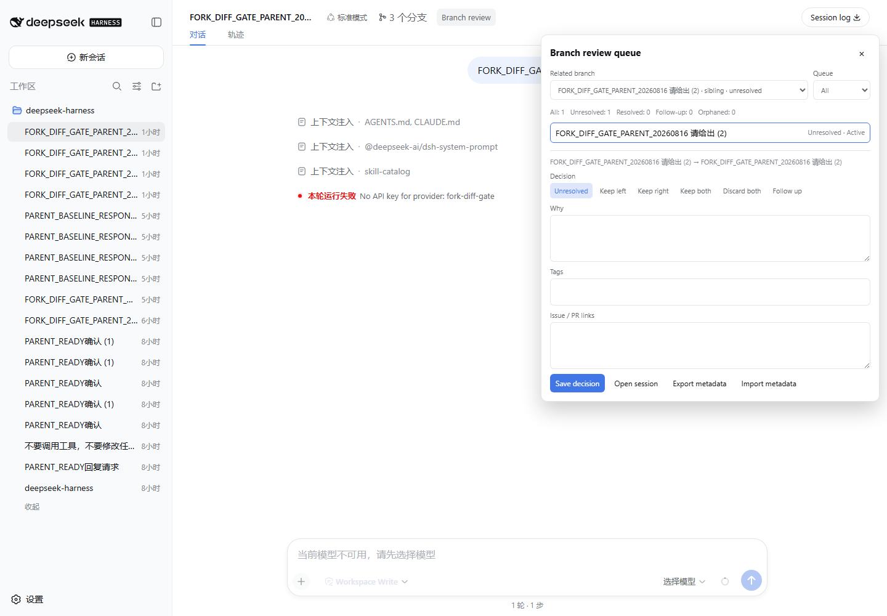
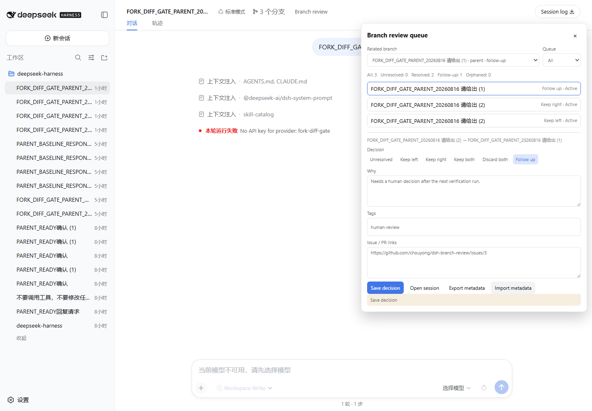
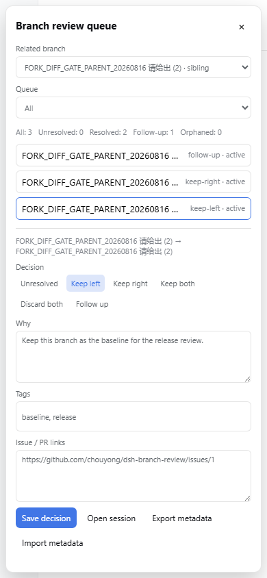

# dsh-branch-review

把 DeepSeek Harness 中真实相关的会话分支比较结果，变成可追踪的人工决策队列。它记录“保留左侧、保留右侧、保留双方、双向淘汰、待跟进”以及用户写下的理由、标签和 issue/PR 链接，不替用户判断赢家。

## 痛点

`dsh-fork-graph` 解决“分支在哪里”，`dsh-fork-diff` 解决“分支有什么不同”。比较结束后仍然缺少一个不会混入无关会话的地方，来记录为什么保留某个分支、哪些分支淘汰、谁需要跟进，以及决定对应的外部工作项。本插件把这一步收口在当前会话标题栏的 Branch review 入口中。

## 功能

- 只从真实 parent/child/sibling 血缘发现候选，不把无关会话放进默认入口。
- 版本化 `ReviewRecord`：稳定记录 ID、左右 session ID、人工状态、短理由、标签、外部链接、创建/更新时间和 schemaVersion。
- 记录失去会话后保留并显示 orphaned；不会静默删除历史决策。
- 队列支持全部、未评审、已决策、待跟进和 orphaned 筛选，按最近更新时间排序。
- 面板摘要显示全部、未评审、已决策、待跟进和 orphaned 数量，帮助人工复核快速判断队列范围。
- 显式导出/导入 JSON；导出只包含评审元数据，不打包 session 正文、工具参数或隐藏运行态。
- localStorage envelope 有 schema 迁移、未知版本拒绝、损坏恢复、重复合并、容量失败保留内存快照和跨标签更新。
- 导入 JSON 在解析前限制为 512 KB，超限 payload 失败关闭，不覆盖现有记录。
- 支持键盘 Escape、焦点恢复、桌面和 390px 移动布局；样式、slot、监听器和存储订阅均有 disposer。

## 安装

需要已验证的 DSH Web profile 和 Node.js `^22.19.0 || >=24.0.0`。GitHub Release 尚未创建；只有满足 `docs/publication-eligibility.md` 的 24 小时、10 个真实提交和 Claude GO 条件后，才会发布下面的版本化 URL：

```powershell
dsh plugin --profile web add https://github.com/chouyong/dsh-branch-review/releases/download/v0.1.0/dsh-branch-review-0.1.0.tgz
dsh --profile web
```

本次真实门禁使用官方 CLI 的本地 link 安装（不会把本地路径当成 Release 资产）：

```powershell
dsh plugin --profile web add D:\knowledgeBase\dsh-branch-review
```

开发与本地验证：

```powershell
npm install --ignore-scripts --legacy-peer-deps
npm run verify
npm run verify:browser
```

`npm run verify` 执行 typecheck、生产构建、纯函数/存储测试、ModuleLoader bundle contract 和 package contract。`npm run verify:browser` 需要已启动的隔离 DSH Web 和 Edge，并只读取公开 UI；真实安装与门禁的每项结果按 `docs/release-evidence.md` 记录。

卸载：

```powershell
dsh plugin --profile web remove dsh-branch-review
```

## 使用

1. 打开一个有真实 parent、child 或 sibling 的会话。
2. 点击标题栏中的 **Branch review**。
3. 选择相关分支；首次选择会创建一个 `unresolved` 记录。
4. 选择人工状态，填写短理由、标签和外部链接，点击 Save decision。
5. 用队列筛选回看未评审、已决策、待跟进或 orphaned 记录；Open session 只导航到公开会话。
6. 需要迁移时显式 Export metadata；导入前会校验 schema、字段和当前可见血缘。

状态语义：`unresolved` 尚未决定；`keep-left`/`keep-right` 保留一侧；`keep-both` 两侧都保留；`discard-both` 两侧都淘汰；`follow-up` 需要后续工作。插件不自动执行 merge、cherry-pick、fork 或恢复 Agent。

## 隐私边界

- 默认只持久化评审元数据：session ID、人工状态、理由、标签、外部链接和时间戳。
- 不持久化 prompt、assistant 正文、tool arguments/results、凭据、Cookie、环境变量或隐藏运行态。
- Export metadata 必须由用户显式触发；JSON 不包含会话正文。
- 插件只读取 `sessions.list` 并调用 `sessions.open(id)` 导航；不写 session event、不创建 fork、不上传会话。
- localStorage key 为 `dsh-branch-review.records.v1`；卸载会移除 UI effect，但不会擅自删除用户显式保存的评审记录。

## 兼容性

| 组件 | 目标/已核验事实 |
| --- | --- |
| DeepSeek Harness | `0.1.0-rc.5` 源码契约；npm 发布版 slot 必须单独核验 |
| DSH slot | `conversation.session.header.actions`；不依赖主干新增 `.utilities` |
| Node.js | `^22.19.0 || >=24.0.0` |
| 浏览器构件 | `window.__ModuleLoader__.load`，React/Cordis/DSH UI external |

## 与相邻插件的区别

- `dsh-fork-graph`：展示血缘图，不记录决策。
- `dsh-fork-diff`：只读比较公开历史，不记录决策。
- DSH share/repro/export：用于分享、复现或导出会话内容；本插件导出的是用户选择的评审元数据，不默认导出会话正文。

## 真实证据

以下文件由真实 DSH Web + Microsoft Edge 门禁生成，不是概念图或重绘：







动画证据：[真实交互短 GIF](./assets/branch-review-flow.gif)。构件、截图、GIF、profile、安装尝试和每项检查的哈希见 [`docs/release-evidence.md`](./docs/release-evidence.md) 与 [`docs/browser-gate-receipt.json`](./docs/browser-gate-receipt.json)。本次 profile 没有配置模型 API key；门禁不发送消息、不读取或记录任何密钥，截图中的宿主会话错误属于既有 DSH 会话状态，不是浏览器 console/page/request error。

## 开发文档

- [架构与失败关闭](./docs/architecture.md)
- [真实门禁证据](./docs/release-evidence.md)
- [GitHub 发布资格](./docs/publication-eligibility.md)
